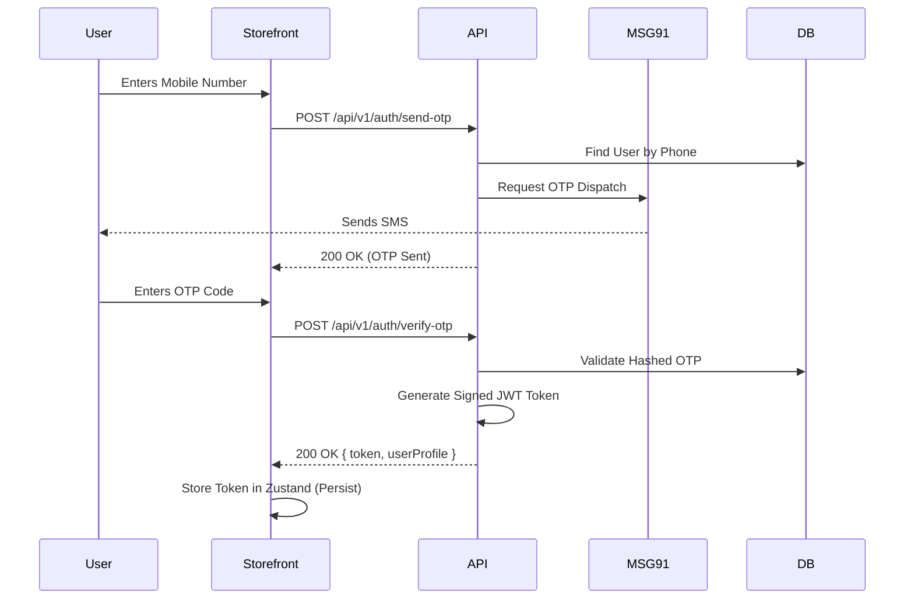
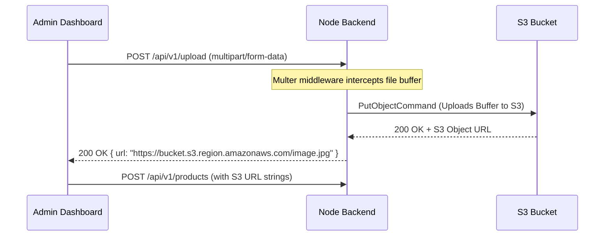

# Kevix System Architecture & Design

This document provides a detailed architectural blueprint of the Kevix E-Commerce ecosystem. It defines the component structures, data flow, external integrations, and database schemas.

---

## 1. High-Level Architecture (C4 Context)

The system is designed as a traditional decoupled 3-tier architecture, heavily utilizing RESTful APIs for communication between the presentation layers (React/Next.js) and the business logic layer (Express/Node.js).

```mermaid
graph TD
    %% Entities
    Customer([🛒 Customer])
    Admin([👨‍💼 Store Admin])
    
    %% Presentation Layer
    subgraph Frontend [Client Applications]
        Storefront[Next.js Storefront]
        Dashboard[React Vite Admin Panel]
    end

    %% Backend Layer
    subgraph Backend [Backend Services]
        API[Express.js REST API]
        S3[AWS S3 - Image Storage]
        MongoDB[(MongoDB Database)]
    end

    %% External Integrations
    subgraph External [External APIs]
        MSG91[MSG91 Messaging API]
        WhatsApp[Meta WhatsApp API]
    end

    %% Relationships
    Customer <--> |Browses, Adds to Cart, Buys| Storefront
    Admin <--> |Manages Orders, Products| Dashboard
    
    Storefront <--> |JSON over HTTPS| API
    Dashboard <--> |JSON over HTTPS (JWT Admin)| API
    
    API <--> |Mongoose ODM| MongoDB
    API --> |Uploads Images| S3
    API --> |Triggers OTP/SMS| MSG91
    API --> |Triggers Updates| WhatsApp
```

---

## 2. Authentication & Authorization Flow

Kevix relies on a robust native OTP system and JSON Web Tokens (JWT) to establish stateless authentication across the Next.js and React clients.

### 2.1 OTP Verification Flow


---

## 3. Core Domain Models (Database Schema)

The database design favors a normalized approach for orders and users, but denormalizes certain product metrics (like average rating) for faster read performance on the storefront.

### 3.1 Product Schema Model
```xml
<Schema name="Product">
    <Field name="_id" type="ObjectId" required="true" />
    <Field name="name" type="String" required="true" />
    <Field name="slug" type="String" unique="true" />
    <Field name="category" type="ObjectId" ref="Category" />
    <Field name="price" type="Number" description="Retail Price" />
    <Field name="mrp" type="Number" description="Maximum Retail Price" />
    
    <Field name="isLot" type="Boolean" default="false" />
    <Object name="lotDetails">
        <Field name="fullLotQuantity" type="Number" />
        <Field name="fullLotPrice" type="Number" />
        <Field name="halfLotQuantity" type="Number" />
        <Field name="miniLotQuantity" type="Number" />
    </Object>

    <Field name="hasModels" type="Boolean" default="false" />
    <Array name="availableModels">
        <Object>
            <Field name="modelName" type="String" />
            <Field name="stock" type="Number" />
        </Object>
    </Array>

    <Array name="images" type="String" description="AWS S3 URLs" />
</Schema>
```

### 3.2 Order Schema Model
```xml
<Schema name="Order">
    <Field name="_id" type="ObjectId" />
    <Field name="orderNumber" type="String" unique="true" />
    <Field name="user" type="ObjectId" ref="User" />
    
    <Array name="items">
        <Object>
            <Field name="product" type="ObjectId" ref="Product" />
            <Field name="quantity" type="Number" />
            <Field name="price" type="Number" />
            <Field name="modelName" type="String" optional="true" />
            <Field name="lotType" type="Enum[full|half|mini]" optional="true" />
        </Object>
    </Array>

    <Object name="shippingAddress">
        <Field name="street" type="String" />
        <Field name="city" type="String" />
        <Field name="state" type="String" />
        <Field name="pincode" type="String" />
    </Object>

    <Field name="status" type="Enum[PENDING|CONFIRMED|PACKED|SHIPPED|DELIVERED|CANCELLED]" />
    <Field name="totalAmount" type="Number" />
</Schema>
```

---

## 4. Frontend Component Architecture (Storefront)

The Next.js storefront heavily leverages the modern App Router (`/app`), Server Components where SEO is critical, and Client Components for interactivity.

```mermaid
graph TD
    %% Directory Structure
    App[app/] --> Layout[layout.tsx - Global Providers & Navbar]
    App --> Home[page.tsx - Landing Page]
    App --> Product[product/]
    Product --> ProductID[[id]/page.tsx - Product Details]
    App --> Category[category/]
    Category --> CategorySlug[[slug]/page.tsx - Listing Page]
    
    %% Components
    Layout -.-> Header[Header Component]
    Home -.-> Carousel[Hero Carousel]
    Home -.-> ProductCard[Product Card Grid]
    ProductID -.-> Zoom[Image Zoom Component]
    ProductID -.-> Lot[Lot Selector Component]
    
    %% State Management
    State[Zustand Store] --> Cart[useCartStore]
    State --> Auth[useAuthStore]
    State --> Wishlist[useWishlistStore]
    
    Cart -.-> Header
    Auth -.-> Header
```

---

## 5. Notification & Order Lifecycle Engine

The backend incorporates an event-driven mindset for handling post-checkout logic, specifically regarding SMS and WhatsApp notifications.

1. **Order Creation:** User checks out on the Storefront.
2. **Database Write:** `OrderController` creates an order and links the Customer ID.
3. **Admin Trigger:** Store Admin views `/admin/orders` and clicks "Mark as Packed".
4. **Status Update:** `AdminOrderController` updates the MongoDB status to `PACKED`.
5. **Notification Engine:** The `AdminOrderController` invokes `SMSService.sendOrderStatusUpdate(phone, orderNumber, 'PACKED')`.
6. **Omnichannel Dispatch:** 
    - `SMSService` hits MSG91 Flow API.
    - MSG91 dispatches a WhatsApp message.
    - MSG91 dispatches a standard SMS message.

---

## 6. S3 Image Upload Pipeline (Admin Panel)

Handling images securely is critical to ensure the server doesn't crash from memory overloads during bulk uploads.



## 7. Scaling Considerations & Future-Proofing

- **Caching:** The backend currently utilizes in-memory node caching for high-read routes (e.g., fetching categories). In the future, this can easily be swapped for **Redis** if deploying behind a load balancer.
- **Microservices:** While currently a monolith API, the `SMSService` and `OrderService` are cleanly isolated, meaning notification workers could be extracted into an AWS SQS queue system if high-throughput order processing is required.
- **Database Indexing:** Ensure indexes exist on `Product.category`, `Product.slug`, and `Order.user` to maintain sub-100ms query times as the database scales past 100,000 records.
